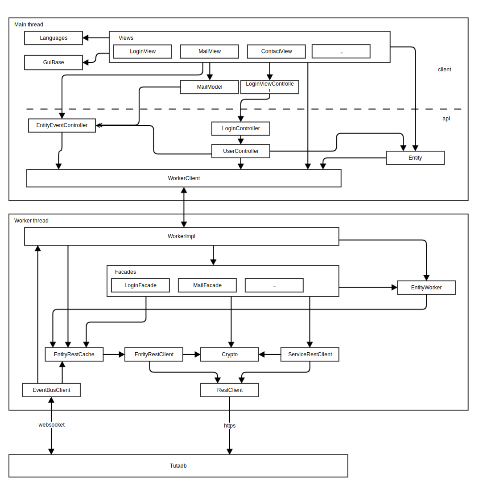

# Hacking on the Tutanota client



## Basic structure
 * `src`: Common part and the desktop client code
 * `app-android`: Android specific parts
 * `app-ios`: iOS specific parts
 * `flow: contains `*implicitly* imported [Flow](https://flow.org/) typing definitions. Avoid putting something there,
 it is buggy.
 * `libs`: "vendor" directory containing our dependencies in non-minified and minified form. May be improved. We take
 security seriously so we review diff between each version.
 * `resources`: some resources (mostly images) which are used in the project. Most of the are embedded to the code.
 * `test`: test code
 * `android.js`: script for building Android app
 * `make.js`: script for building dev version
 * `dist.js`: script for building release versions of the web & desktop clients
 * `fdroid-fix-deps`: script for removing some binary dependencies (iOS, Flow & Electron) so that we pass F-Droid checks
 * `fdroid-metadata-workaround`: is a link inside app-android so that F-Droid can find our metadata because our Android
 project is not in the root. Can be removed once it's fixed in F-Droid.
 * `server`: dev server to serve code (you still need to connect to real backend)
 * `tutao-pub.pem`: public key which is used to verify desktop clients
 
## Code structure
Web part of the app is split in three parts: client, worker and common.
All code in the `src` except for the `api` directory is intended for GUI and system interaction. Code in the `api`
contains most of the logic for server communication, encryption, indexing etc.

### Glossary
 * `SomethingView`: Big part of the app, corresponds to the URL, e.g. `mail`, `contact`, `settings`, `search`
 * `SomehingListView`: Component which displays things in the list, usually in the second column
 * `SomethingViewer`: Component which usually displays one element (e.g. selected email or contact)
 * `SomethingModel`: Logic for some part of the app, lives in the main part
 * `SomethingController`: Something that does some bookkeeping or general action but is not tied to the specific part
 * `SomethingFacade`: Logic for one domain, lives in the api part
 * `SomethingApp`: Something that communicates with native part to execute tasks in certain domain
 * `app`: Part of the bigger domain structure. Currently there's `system` app for accounts and such and
 `tutanota` app for mails and contacts
 * `Entity`: Object corresponding to the server database entity
 * `TypeModel`: Describes entity type
 * `TypeRef`: Small object which lets us know which entity it is and find `TypeModel` if needed

### Communication
Worker, main thread & apps communicate through the messages. Protocol is described in the
[WorkerProtocol](../src/api/common/WorkerProtocol.js). See [WorkerClient](../src/api/main/WorkerClient.js) and
[WorkerImpl](../src/api/worker/WorkerImpl.js) for the client and server part.

Native code communicates through the [NativeWrapper](../src/native/NativeWrapper.js).

### UI code
UI code uses [Mithril](http://mithril.js.org/). It is a tiny framework which does routing & implement virtual DOM.
It uses a "hyperscript" language (`m(ComponentOrDomElement, {param: value}, [children]`). It may seem intimidating
at first but it's actually quite simple.

#### Defining a new Mithril component
Our preferred way of making Mithril components is through the ES6 classes. Before we've been creating instances of
these classes manually but that's not how Mithril should be used. Preferred way is to pass class and attributes
("props" if you come from React) to hyperscript and let it do its thing. Because of that we sometimes have two versions
of the components, newer one has "N" suffix like `ButtonN`. It is almost always preferable to use new-style components.

Current preferred way looks roughly like that:

```javascript
// Defining

type Attrs = {param1: string, paramTwo?: number}

class MyComponent implements MComponent<Attrs> {
	view(vnode: Vnode<Attrs>) {
		return m(".h1", "Hello " + vnode.attrs.param1)
	}
}

// Usage

// ...
m(MyComponent, {param1: "Mithril", param2: 1})
```


### Network
For working with entities it is preferable to use injected `EntityWorker` whenever possible and not using freestanding
functions. It makes easier to substitute network interfaces when needed.

One level below `EntityWorker` lays `EntityRestInterface` which is either `EntityRestClient` or `EntityRestCache`
currently. Caches saves requested entities is the memory and updates them with WebSocket events.

If you're listening for WebSocket updates in the worker part (and you should justify doing that) then you should change
[EventBus](../src/api/worker/EventBusClient.js) to do that. For the main thread you can subscribe to the 
[EventController](../src/api/main/EventController.js).

`EventBus` and `EntityRestClient` make sure that entities are automatically encrypted/decrypted when needed. See
[decryptAndMapToInstance()](../src/api/worker/crypto/CryptoFacade.js).

#### Entity updates
Most of the server database changes are reflected in the `EntityUpdate`s we receive from server. They describe
operation which happened to the entity. Updates are grouped into `EntityEventBatch`es. These batches are ordered and
client tries tp stay up-to-date with the server (for caching and indexing).

## Workflow
`node make -w prod`

and in parallel

`node server`

Point browser of your choice to the `localhost:9000` and you should be good to go.

To run tests:

`cd test`
 
and

 `node test api` or `node test client`
