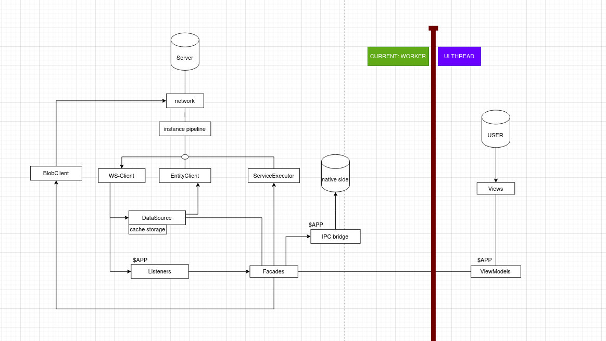

# Modularized Tuta

## Goal:

Have a collection of relatevely isolated modules with clear dependency graph. So we have better
idea of how our final SDK should look like

# Approach

- Use typescript Project references. [link](https://www.typescriptlang.org/docs/handbook/project-references.html)
- Take our logical component and make one module for each. Example: restClient, instancePipeline, offline/cache storage
- Make sure dependencies between such modules are intuitive and sustainable in long run
- Bonus: Re-visit our build process to look for places which can be simplified
  

# Progress So far

Following modules have been seperated so far:

### i) @tutao/app-env

- Contains things that should mainly endup in common-min chunk.
- Contains things that are rather static/ global constants
- Example: appMode, domainConfig, TimeUnits, running platform etc.
- dependency: none

### ii) @tutao/utils

- All out utilities function that does not hold any state
- Can be possibly duplicated across chunk
- dependency: none

### ii) @tutao/rest-client

- Component that can make http request, handle suspension and give back response
- Only deals with raw bytes and does not concern with our typemodel or encryption
- dependency: utils, app-env

### iii) @tutao/typerefs

- Component that define our TypeModels, generate typerefs and service defination
- Supporting components like: TypeModelResolver, PatchGenerator, AttributeModel
- Dependency: utils, app-env

### iv) @tutao/instance-pipeline

- Component that can take response form server and turn it into typescript object
- Deals with things like: decryption, typeMapping, patchMerging
- Depends on: utils, typerefs, crypto

### v) @tutao/crypto-primitives

- Ts binding for crypto implementation done in rust code
- Depends on: none

### vi) @tutao/crypto

- Isolated components related to crypto
- Currently: former: packages/tutanota-crypto
- Future: more stuff like keyCahce, parts of cryptoFacade and so on
- Depends on: utils, crypto-primitives

### vii) @tutao/usagetests

- Former: packages/tutanota-usagetests
- Depends on: none

### viii) @tutao/wasm-loader

- Former: packages/tutanota-wasm-loader
-
    - Depends on: utils

### x) @tutao/mimimi

- Bindings and implementaion of tutao_node-mimimi
- mainly used for mail-import
- Depends on: nothing

### x) @tutao/combined-apps

- Rets of our codebase is included here.
- Next goal is to extract more components from this module
- Depends on: everything else

## Visible changes:

- No more `npm run build-packages`
- More tests run on browser
- Ability to add middlewares in rest-client

## Future Plan:

- Have one module per app
- things that are shared between apps should be extracted in some shared smaller module
- Make sure dependency between modules are explainable with strong reason
- Be in a state where ViewModels can work with very thin api exposed by components that
  lives in worker ( if not currently )
- Have a look at our build process to see if these changes can help simplify

### Questions and Notes