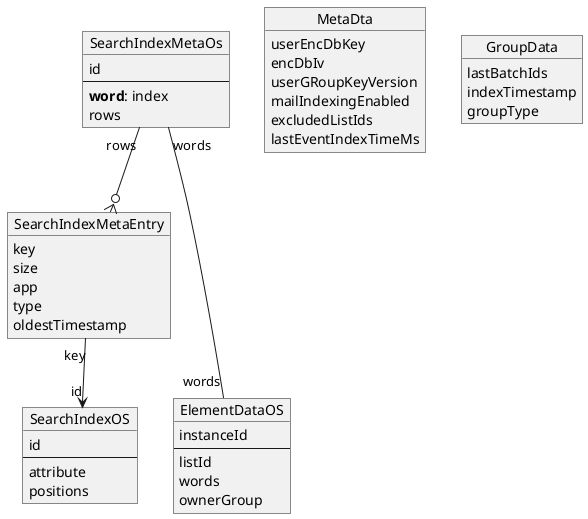

# General structure
Indexer - entry point, start/extend/update index

Specific indexers - for specific types

IndexerCore - encrypt, write to db

DbFacade - access to indexeddb

SearchFacade - run search on indexed data

## Mail indexer

Goes over each mailbox in lockstep:

- load mailsSearchFacade from the specified date range (one day)
- load referenced mail details/attachments
- create search index entries
    - extract attributes
    - tokenize
    - result is map from word to attributes with positions
- encrypt search index entries
    - key is encrypted word
    - value is attribute + positions, encoded using our binary encoding and encrypted
    - result is

 ```ts
{
    //...
    encInstanceIdToElementData: Map<B64EncInstanceId, ElementDataSurrogate>
    // For each word there's a list of entries we want to insert
    indexMap: Map<B64EncIndexKey, Array<EncSearchIndexEntryWithTimestamp>>
}

export type ElementDataSurrogate = {
    listId: Id
    // we store it here instead of SearchIndexEntry to allow moving mails without changing the SearchIndexEntries for the mail
    encWordsB64: Array<B64EncIndexKey>
    ownerGroup: Id
}
```

- if we collected enough mails (500+), write it to indexedDB
    - includes updating timestamp for each group (mailbox)

## IndexedDB logical structure (ignoring encryption and DB representation)



We have indirection from words to `SearchIndex` through `SearchIndexMeta` as an optimization. When the rows
in indexedDB get too big (e.g. for very common terms) they are very slow to update so we split them and do some manual
bookkeeping.

In practice `SearchIndexMetaEntry`s are encrypted and serialized into one big binary blob. We do concat them into a
single blob because otherwise GC pressure is too high.

## Search
- Tokenize
- Slightly separate process for the first word and subsequent words
- There is SuggestionFacade, these days it's only used for contacts
    - We can also replace this on mobile, but we can also ignore it for now
- find index entries
    - encrypt the token, load the SearchIndexMetaEntry entry
    - filter the rows by app and type
    - read SearchIndexEntries
    - filter those that don't have some of the tokens (_filterByEncryptedId)
    - decrypt index entries
    - filter by type, attribute and time
    - filter by position of words (_reduceWords)
    - reduce to unique element ids
    - filter by folder/list id
- The process is iterative: we start by reading a certain number of rows and then narrow it down
    - Search result contains `moreResults`: if we have more items than we needed in "filter by folder/list id" phase
    - We remember the oldest timestamp for each token (`lastReadSearchIndexRow`). If we need more results we read older
      tokens.
