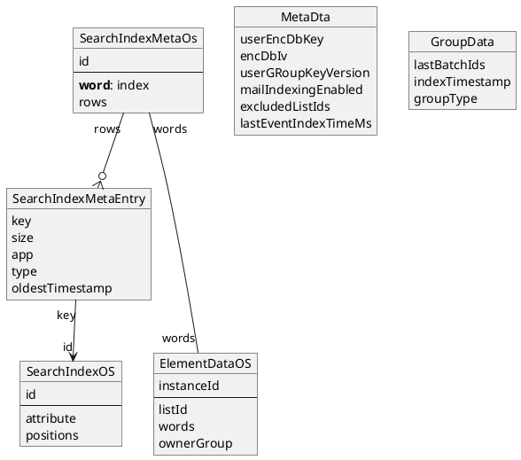

Mail indexer

Goes over each mailbox in lockstep:
- load mails from the specified date range (one day)
- load referenced mail details/attachments
- create search index entries
	- extract attributes
	- tokenize
	- result is map from word to attributes with positions
- encrypt search index entries
	- key is encrypted word
	- value is attribute + positions, encoded using our binary encoding and encrypted
	- result is
 ```ts
{
    //...
    encInstanceIdToElementData: Map<B64EncInstanceId, ElementDataSurrogate>
    // For each word there's a list of entries we want to insert
    indexMap: Map<B64EncIndexKey, Array<EncSearchIndexEntryWithTimestamp>>
}

export type ElementDataSurrogate = {
    listId: Id
    // we store it here instead of SearchIndexEntry to allow moving mails without changing the SearchIndexEntries for the mail
    encWordsB64: Array<B64EncIndexKey>
    ownerGroup: Id
}
```
- if we collected enough mails (500+), write it to indexedDB
	- includes updating timestamp for each group (mailbox)

IndexedDB logical structure (ignoring encryption and DB representation)


```plantuml
@startuml
object SearchIndexMetaOs {
    id
    --
    **word**: index
    rows
}

object SearchIndexMetaEntry {
    key
    size
    app
    type
    oldestTimestamp
}

SearchIndexMetaOs "rows" --o{ SearchIndexMetaEntry

object SearchIndexOS {
    id
    --
    attribute
    positions
}
SearchIndexMetaEntry "key" --> "id" SearchIndexOS

object ElementDataOS {
    instanceId
    --
    listId
    words
    ownerGroup
}

SearchIndexMetaOs "words" --- "words" ElementDataOS

object MetaDta {
    userEncDbKey
    encDbIv
    userGRoupKeyVersion
    mailIndexingEnabled
    excludedListIds
    lastEventIndexTimeMs
}

object GroupData {
    lastBatchIds
    indexTimestamp
    groupType
}
@enduml
```

We have indirection from words to `SearchIndex` through `SearchIndexMeta` as an optimization. When the rows
in indexedDB get too big (e.g. for very common terms) they are very slow to update so we split them and do some manual
bookkeeping.

In practice `SearchIndexMetaEntry`s are encrypted and serialized into one big binary blob. We do concat them into a
single blob because otherwise GC pressure is too high.

