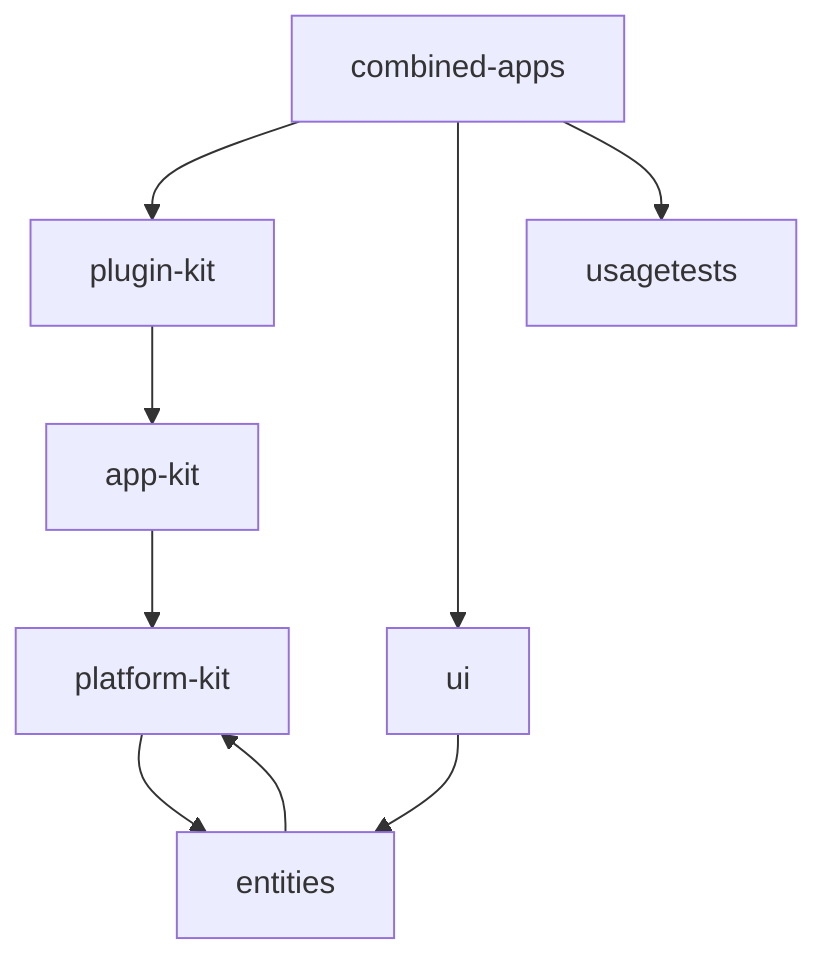
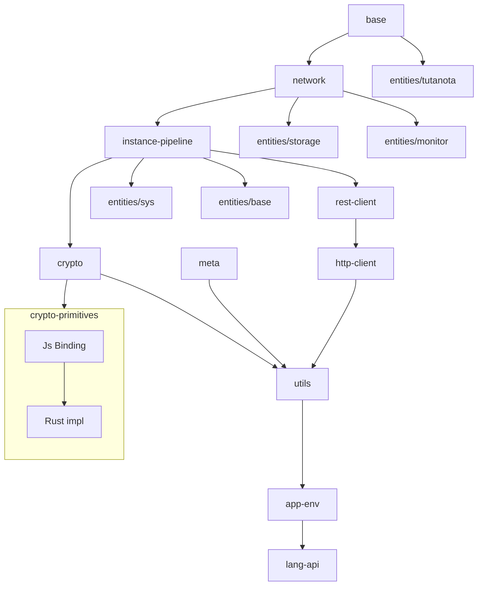
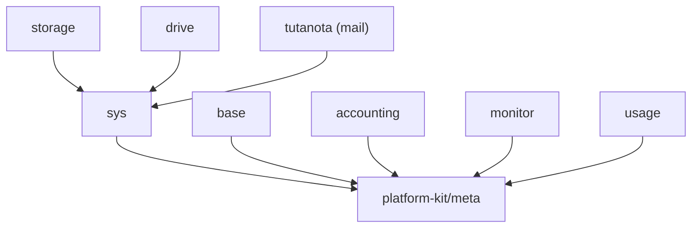
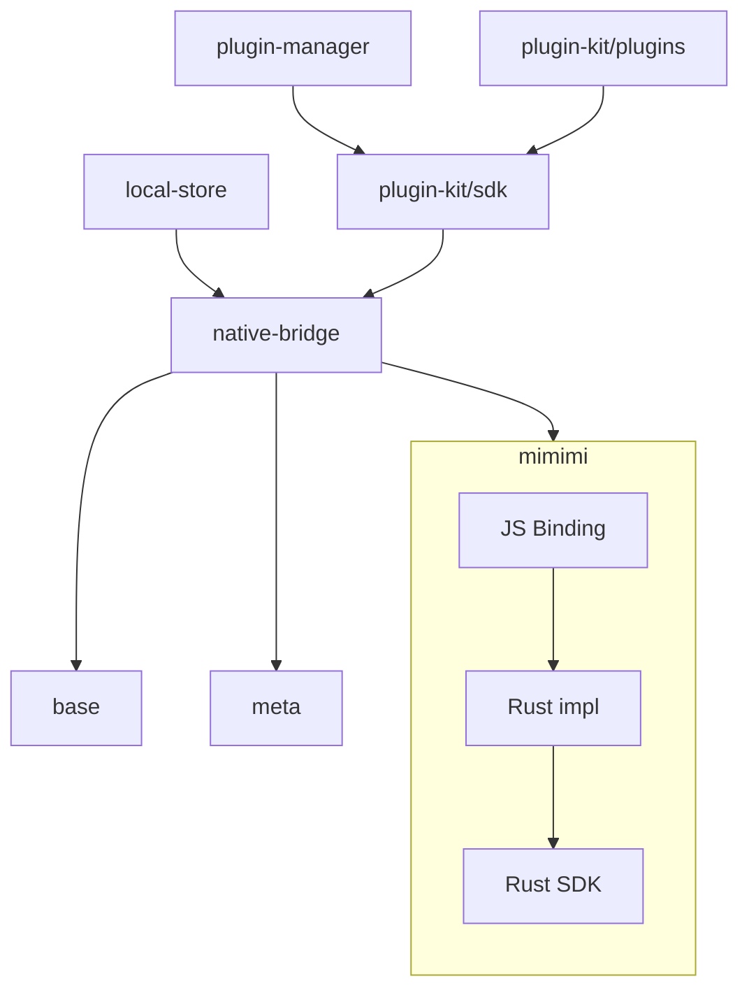
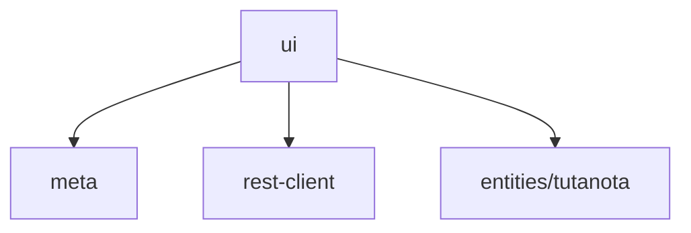
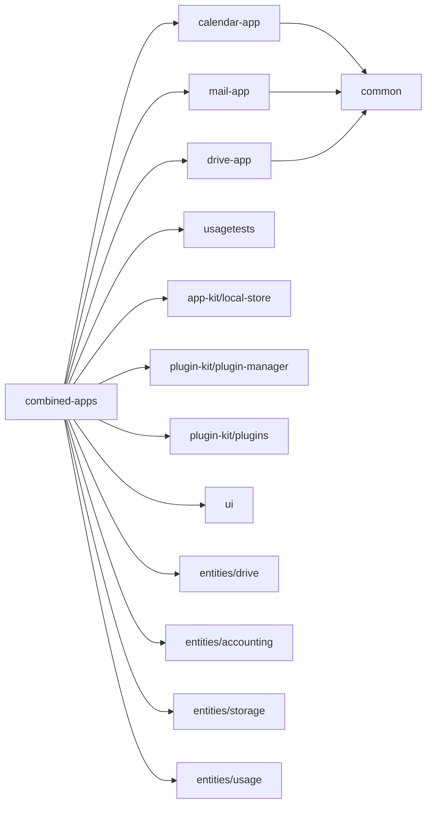

# Project Structure

## Overview (module groups)

## platform-kit

## entities (per-app API types)

## app-kit, plugin-kit, ui

## ui

## applications

## PlatformKit/Lang-Api

Lang-Api is the lowest level for rest of the codebase. It encapsulates the TypeScript language construct and external
dependencies.

Extracting those into separate module helps us to extract things that needs to be manually implemented by target
language of transpiler. Given that rest of the app is build only on top of lang-api (and no other external dependencies
or typescript-specific constructs), transpiled code will look more one-to-one mapping from TypeScript to target
language.

## Code Transpilation

[Transpiler](../../tuta-transpiler) takes the [root tsconfig file](../tsconfig.json) and
generates [swift source](../transpiled/swift-sdk)
and [kotlin source](../transpiled/kotlin-sdk) equivalent in
[transpiled directory](). Lang-api on both kotlin & swift is manually maintained to satisfy the Api surface provided by
typescript's lang-api.