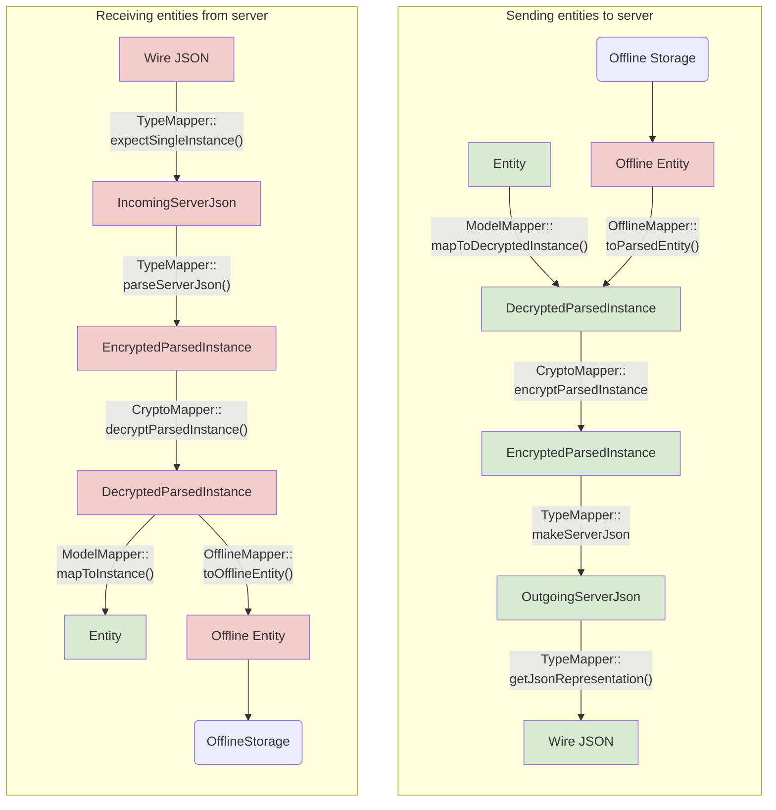
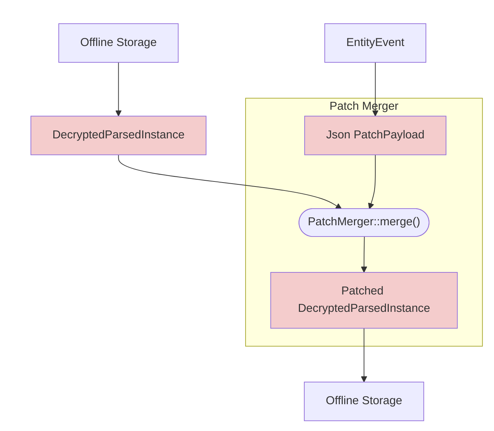
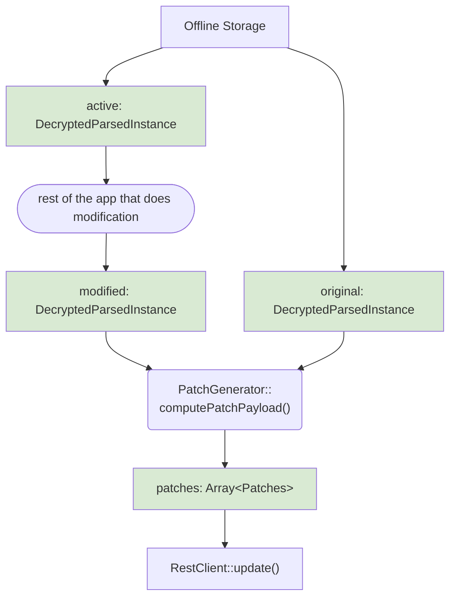

### Color legend:
- Green is Client Model
- Red is Sever Model

## Sending/ Receiving Entities to/ from Server

## Receiving patch from entityUpdate

## Sending Patch to server

## Possible Optimization

Use binary format